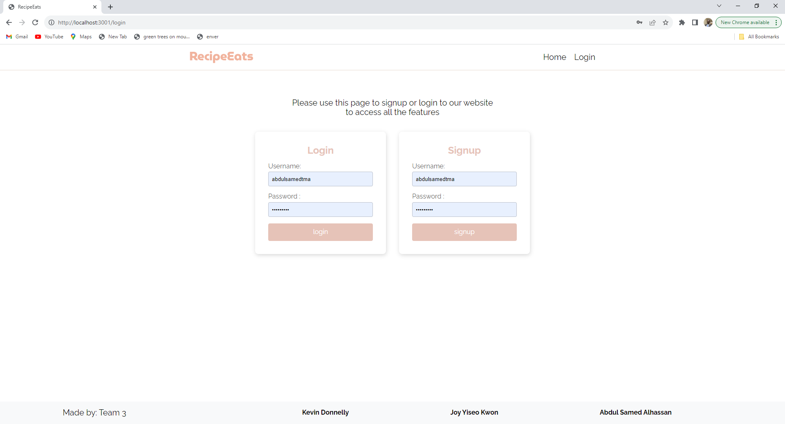

# Recipe Review Website





## Table of Contents

- [Introduction](#introduction)
- [Features](#features)
- [Getting Started](#getting-started)
- [Usage](#usage)
- [Technologies Used](#technologies-used)
- [License](#license)
- [Acknowledgments](#acknowledgments)
- [Questions](#questions)
- [Contribution](#contribution)


## Introduction

Welcome to the Recipe Review Website, a platform dedicated to the culinary arts and the love of cooking. Our website is designed to be a hub for food enthusiasts, home cooks, and professional chefs alike. Whether you're seeking culinary inspiration, looking to share your favorite recipes, or eager to connect with a vibrant community of food lovers, this is the place for you.

## Features

### 1. Recipe Discovery

Explore an extensive collection of mouthwatering recipes spanning various cuisines and meal categories. From appetizers to desserts, our platform offers a diverse array of culinary delights.

### 2. User Reviews

Share your culinary experiences by leaving thoughtful reviews and ratings for recipes you've tried. Your insights will help others make informed decisions about their culinary adventures.

### 3. Recipe Submission

Contribute your unique recipes to our growing database. Whether it's a family heirloom or a creative concoction, our platform is the perfect place to share your culinary creations with the world.

### 4. User Profiles

Create a personalized user profile to showcase your culinary journey. Keep track of your recipe submissions, reviews, and bookmarked favorites.

### 5. Search Functionality

Effortlessly find recipes that match your preferences. Use our advanced search filters to discover dishes by name, cuisine, ingredients, or dietary requirements.

### 6. Community Interaction

Engage with a passionate community of food enthusiasts. Exchange cooking tips, share stories, and connect with fellow foodies who share your culinary interests.

## Getting Started

To begin your culinary adventure on the Recipe Review Website, follow these steps:

1. **Installation**: Clone this repository to your local machine:

   ```bash
   git clone git@github.com:KDonnelly33/Recipe-review.git
   ```

2. **Dependencies**: Install the required dependencies:

   ```bash
   npm install
   ```

3. **Database Setup**: Set up the database and populate it with sample data or configure it to your specifications.

4. **Configuration**: Customize environment variables, database connections, or authentication methods as needed.

5. **Running the Website**: Start the website:

   ```bash
   npm start
   ```

6. **Access**: Access the website through your web browser at `http://localhost:3001` or the specified port.
   [Click Here to access the website](https://protected-escarpment-11572-48e550723f6b.herokuapp.com/)
   
   
## Usage

Once the website is up and running:

- **Browse Recipes**: Explore the diverse collection of recipes showcased on the homepage.

- **Review Recipes**: Share your culinary experiences by providing reviews and ratings for recipes you've tried.

- **Submit Recipes**: Contribute your own recipes to enrich our culinary community.

- **Connect with Others**: Build your profile, connect with fellow users, and participate in discussions and culinary adventures.


## Technologies
Project is created with 
* [Javascript](https://www.javascript.com/)
* [Node.js](https://nodejs.org/en/)
* [Sequelize](https://www.npmjs.com/package/sequelize)
* [connect-session-sequelize](https://www.npmjs.com/package/connect-session-sequelize)
* [MySQL2](https://www.npmjs.com/package/mysql2)
* [Express](https://www.npmjs.com/package/express)
* [Dotenv](https://www.npmjs.com/package/dotenv)
* [bcrypt](https://www.npmjs.com/package/bcrypt)
* [express-handlebars](https://www.npmjs.com/package/express-handlebars)
* [express-session](https://www.npmjs.com/package/express-session-sequelize)
* [tachyons](https://www.npmjs.com/package/tachyons) 
* [Sweetalert2](https://www.npmjs.com/package/sweetalert2)

## License

This project is licensed under the [MIT License](LICENSE). See the [License](LICENSE) file for more details.

## Acknowledgments

Special thanks to our TA for taking the time to help us resolve our merge conflict and providing valuable guidance throughout this project.

## Questions

Have additional questions? Click the links below to reach us through our GitHub account or Email address.

- [Link to Github](https://github.com/KDonnelly33)
- [Connect with Kevin via Email](mailto:Kevin.donnelly3@gmail.com)

- [Link to Github](https://github.com/abdulsamedtma)
- [Connect with Joy via Email](mailto:yiseo1122@gmail.com)

- [Link to Github](https://github.com/abdulsamedtma)
- [Connect with Abdul via Email](mailto:abdulsamedtma@gmail.com)

## Contribution

We welcome contributions from the community to enhance and expand the Recipe Review Website. To contribute:

1. Fork the repository and create a dedicated branch for your changes.

2. Implement your improvements, ensuring that existing tests pass.

3. Document your changes and update any relevant documentation as necessary.

4. Submit a pull request, clearly explaining your modifications and their benefits.

5. Your contribution will undergo review, and upon approval, it will be merged into the main codebase.

Thank you for choosing the Recipe Review Website. We hope you enjoy your culinary journey with us!

